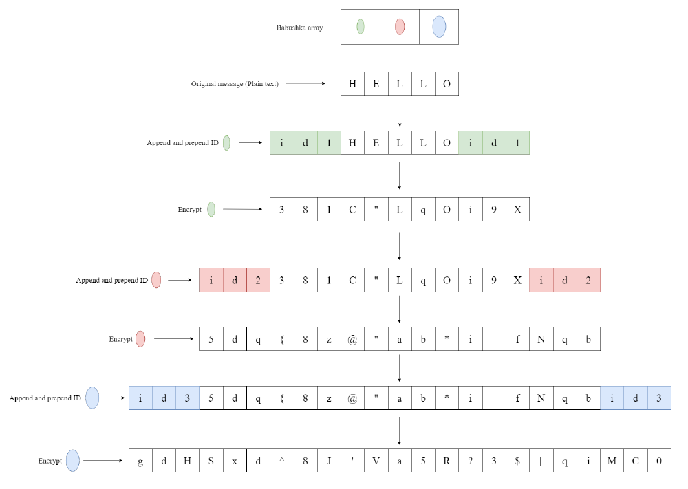

# Babushka Encryption

A project showcasing my familiarity with C++ polymorphism and exception handling.

## Overview

Babushka dolls, or Russian nesting dolls as they are also referred to, are dolls that get progressively larger in size. Each doll is encapsulated within another doll of a larger size. The aforementioned is an analogy used to create an encryption and decryption scheme in this project.

## What is encryption and decryption?

For the purposes of this project, encryption entails transforming plain text into cipher text. Decryption in turn being the opposite, transforming cipher text into plain text.

Plain text is a message that humans can read and understand. Cipher text is the result of encrypting plain text, a message that is impossible for humans to read and understand. 

Encryption makes use of a secret key, this key is used to manipulate plain text, transforming it into cipher text. The process of reversing it is dependent on the key. Hence, you would only be able to decrypt the message if you know what the secret key is. 

The project is a very simplified implementation, and the code is by no means actual cryptography.

## Implementation

Arrays of type ```unsigned char``` are used to store data which is to be encrypted and decrypted based on different strategies. These arrays go through multiple stages, similar to the way Babushka dolls contain smaller dolls in itself. 

### Encryption visualization

Each ```Babushka``` has the ability to encrypt and decrypt, and they are each assigned a colour. Every colour has its own method of encrypting and decrypting the message. 

Moreover, each ```Babushka``` has its own ID, essentially acting as the key for encryption and decryption operations. 

A ```Controller``` class contains an array of ```Babushka``` objects, and in order for encryption to occur, each ```Babushka``` object in the array is used one after the other to progressively encrypt a particular message. Decryption is the reverse of this process (i.e. given a cipher text as input, use the Babushkas to decrypt and obtain the original plain text)



An array with a green, red and blue ```Babushka``` is defined. Each Babushka has its own ```id``` which is set to ```id1```, ```id2``` and ```id3``` for each respective ```Babushka``` (in the actual assignment you will be given these ids). Given the ```Babushka``` array and some plain text, each ```Babushka``` gets a chance to append and prepend its ```id``` to the input and then proceeds to use its particular type of encryption. Each ```Babushka``` is used from left to right in the array for encryption. The output of all previous ```Babushka```s is used as input to the current ```Babushka``` (this is why they are called nesting dolls). The output after the final ```Babushka``` has encrypted is the final cipher text.

### Decryption visualization

Decryption simply needs to undo the encryption result of encryption. Each ```Babushka``` also has a ```decrypt``` function.