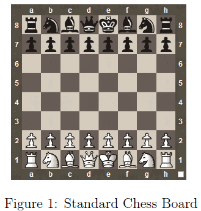

# Checkmate-in-One Puzzle

This project showcases my familiarity with the use of classes, objects, constructors, destructors, dynamic memory and the use of operator overloading.

## Overview

For this assignment I will be implementing a variation of the popular chess puzzle, the Checkmate-in_one puzzle. The game takes place on a standard 8 by 8 chess board with a pre-existing setup for both sides and of all the pieces.

The puzzle with a single player getting to make one move in the game. The goal is to checkmate the opponent with the single move and thus end the game.

This variation has a number of important deviations from the standard formulation of the puzzle:
1. The opposing player, the player who does not move first, can only move their king.
2. The opposing king, the one being subject to the potential checkmate, cannot take any enemy pieces.
3. No opposing piece can be used to block an attempt at a checkmate.
4. No pieces will be captured during play.
5. The use of castling, en passant capture or promotion of pawns is not allowed.

Given the two sides, white and black, and white being the one trying to checkmate black, the opposing player in this example will be black. If black were the side to attempt to checkmate white, then white would be the opposing player. 

In this project I will be implementing a program that enables the solving of this kind of puzzle.

## Game Rules

### Game Board

Chess is played on a standardised 8 by 8 board. In real life, chess boards are labelled with a combination of letters and numbers to make the moves easier to interpret by the players and spectators. However for this assignment the chess boards will only referred to by numbers.

For example, consider,
```
01234567
0--------
1--------
2--------
3--------
4--------
5--------
6--------
7--------
```

This is a board made of 8x8 tiles. Each tile represents the open sea and the board is currently completely empty. The positions of the each tile, in terms of coordinates it reflects is given by the numbers. The top leftmost corner is (0,0) and the bottom rightmost corner is (7,7). If compared to a standard chess board such as in Figure 1.



Position (0,0) would correspond to A8 and position (7,7) would correspond to H1. The x coordinate refers to the row and the y coordinate refers to the column. The use of the ````−```` string is used to indicate an empty board space. All spaces not taken up by a piece on the board will be set to this string.

### Pieces

The standard game of chess is played with equal pieces between the players. For the purposes of this project the pieces are referred to on the board by a combination of their colour and their type. For example the string, “bb” would refer to a black bishop whereas “wp” would refer to a white pawn. The full list of types for the pieces is produced below:
- ```p```: pawn
- ```b```: bishop
- ```k```: knight
- ```K```: king
- ```q```: queen

For example, consider a board with two black pawns, a black king, a white king and two
white rooks,

```
wr-------
----wK----
--------
--------
-bpbp----wr
-bK------
--------
--------
```

### Move

For this puzzle, only one side has to submit a move. The move has the following format:

X1,Y1,X2,Y2

The list is delimited by commas and the first two values refers to the x and y coordinates of the piece to be moved and the second set of coordinates refer to its new position.
Note that X refers to the row and Y refers to the column in the matrix. This could be interpreted as chessboard[X1][Y1] for instance.

For the sake of simplicity, white will always be the side to move from bottom to top (i.e. [Y7] to [Y0]), while black will always be the side to move from top to bottom (i.e. [Y0] to [Y7]).

## Classes

### Piece Class

The basis of the project is the ```piece``` class. It is comprised of two files: **piece.h** and **piece.cpp**. A UML diagram for the class is provided to you below:
```
piece
-pieceType:string
-side:char
-xPos:int
-yPos:int
------------------------
+piece()
+piece(newPiece: piece *)
+piece(pType:string, side:char,x:int,y:int)
+∼piece()
+getSide():char
+getPieceType():string
+getX():int
+getY():int
+setX(x:int):void
+setY(y:int):void
+friend operator<<(output:ostream &, t:const piece &):ostream&
+operator[](pos:int):void
+operator+(move:string):piece&
```

#### Member Variables

- ```pieceType```: The string variable indicating what kind of piece it is. The values are as follows:
    - King
    - pawn
    - queen
    - bishop
    - knight
    - rook
- ```xPos```: The X coordinate of the piece on the board.
- ```yPos```: The Y coordinate of the piece on the board.

### Member Functions

- ```piece```: The default and empty constructor for the piece class. It is blank.
- ```piece(newPiece:piece*)```: This is a copy constructor for the piece class. It receives an instantiated piece object and copies the values of that object into a newly constructed instance.
- ```piece(pType:string,side:char,x:int,y:int)```: This is a value-based constructor for the class. It takes 4 separate arguments which all correspond to values inside the class.
- ```∼piece```: The class destructor. This deallocates any allocated memory of the class. It also prints out (with a new line at the end), the following message: "(X,Y) side type deleted" where side refers to the side of the ship of the piece, type the piece type and the X,Y coordinates where it was found on the board. An example of this output is:
```
(0,0) b rook deleted`
```
The coordinates are printed first, followed by the side and then the piece type.

- ```getSide```: This returns the side char for the piece.
- ```getPieceType```: This returns the type of the piece.
- ```getX```: This returns the X coordinate variable.
- ```getY```: This returns the Y coordinate variable.
- ```setX```: This sets the x coordinate to the passed in value.
- ```setY```: This sets the y coordinate to the passed in value.
- ```operator[](pos:int)```: This is an overload of the [] operator. When called, this will receive an int that takes either the values 0 or 1. If any other value is provided print the message: ”Invalid Index” with a new line at the end. If the index is valid, it should print out one of two messages with a new line at the end. If the value is 0, it should print out the x coordinate and if 1, the y coordinate. The format of the messages are as follows:
```
x coord: 1
y coord: 2
```
The above examples show the output for two different calls of the operator. Only one line of output should be given per call.
- ```operator+(move:string)```: This operator will receive a string with the format
```
x,y
```
where x represents an x coordinate and y represents a y coordinate. If the coordinates are valid (that is within the valid range of the chess board) then the appropriate variables should be set with these variables. If the coordinates are invalid, then nothing should happen.
- ```operator<<```: It also prints out (with a new line at the end), a message in the following format:
```
b rook at [0,0]
```
The side is printed first, then the piece type followed by the coordinates at the end. This message must be sent to the output variable.