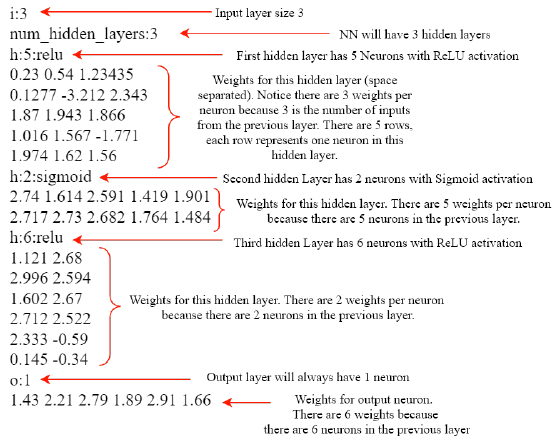

# Neural Network Simulator

This projects showcases my familiarity with C++ classes, objects and dynamic memory.

## Overview

In the field of Artificial Intelligence (AI), Neural Networks (NNs) are powerful tools facilitating the so-called "Fourth Industrial Revolution".

## What is a Neural Network?

For the purpose of this project, a NN is made up of layers of neurons. Connecting these neurons together forms a model of the human brain. Neurons are represented using circles in a graph-like structure. In this scenario, there is only one input layer, one output layer, and one or more hidden layers which are in between the input and output layer.


Values move from the input layer to the output layer i.e. from **left** to **right** through the network (this is the forward direction). Each neuron in a layer is connected to every neuron in the next layer via what is known as a *weight*. In order for a value to move forward in a network, it must be multiplied by the weight which attaches it to the next neuron in the network. After a value is aggregated in a neuron a non-linear activation function is applied. The output of a neural network is the value(s) that emerge from the output layer, after the input values have made their way through the entire network. In this assignment, there will only be a single neuron in the output layer, and thus there will only be a single output value from the NN.

## Why are Neural Networks so useful?

Neural networks are known as *univeral approximators*. Although a NN is essentially a bunch of numbers being multiplied together, the weights of these networks are able to be adjusted in order to model different functions both linear and non-linear. In practice large networks allow computers to be able to perform useful tasks, some of which are classifying images, recommending movies and interpreting speech.

This project is significantly simplified compared to real-life implementations. The program will be implementing a forward pass through a fully connected neural network.

**Note:** There are no biases in this program.

## UML Class Diagrams

### Input Layer

```
- numInputs: int
- inputs: double*
---
+ InputLayer(numInputs: int)
+ ~InputLayer()
+ getInputs(): double
+ getNumInputs(): int
+ setInputs(inputs: double*): void
+ setNumInputs(numInputs: int): void
+ printLayer(): void
+ clearLayer(): void
```

#### Member Variables

- ```numInputs``` represents the number of inputs to the first layer of the NN.
- ```inputs``` is a dynamic array ```double``` array. These values are the inputs to NN. 

#### Member Functions

- ```InputLayer(int numInputs)```
    - Constructor that accepts the ```numInputs``` as a parameter and sets the corresponding member variable.
- ```~InputLayer()```
    - Destructor that deallocates the ```inputs``` array
- ```getInputs()```
    - Returns the ```inputs``` array
- ```getNumInputs()```
    - Returns the number of the inputs of the NN
- ```setInputs(double* inputs)```
    - Sets the ```inputs``` member variable to the argument (without a deep copy).
    - If inputs are already set, the existing inputs should be deallocated first.
- ```setNumInputs(int numInputs)```
    - Sets the ```numInputs``` member variable to the value of the argument
- ```printLayer()```
    - Prints the string ```i:x``` where ```x``` is the ```numInputs``` of this layer.
- ```clearLayer()```
    - Sets each element of the ```inputs``` array to zero.
    - If the inputs array is NULL, then do nothing.

### Hidden Neuron

The class represents a single neuron stored in the hidden layer, hidden neurons are the only neurons that can get activated. 

```
- value: double
- numWeights: int
- weights: double*
---
+ HiddenNeuron(numWeights: int, weights: double*)
+ ~HiddenNeuron()
+ getValue(): double
+ setValue(value: double): void
+ forward(prevLayer: HiddenLayer*) : void
+ forward(prevLayer: InputLayer*) : void
+ activateReLU() : void
+ activateSigmoid() : void
```

#### Member Variables

- ```value``` represents the current value that this neuron holds
- ```numWeights``` holds the size of the weights array. The value corresponds to the number of neurons in the previous.
- ```weights``` is a dynamic ```double``` array containing the values of the weights connecting to this neurons from the previous layer.

#### Member Functions

- ```HiddenNeuron(int numWeights, double* weights)``` is a constructor that accepts the  ```numWeights``` and ```weights``` array and sets the corresponding member variables, without a deep copy. ```value``` is initialized to zero.
- ```~HiddenNeuron()``` the destructor deallocates the ```weights``` array.
- ```getValue()``` returns the value of this neuron.
- ```setValue(double value)``` sets the ```value``` of this neuron to the value of the argument.
- ```forward(HiddenLayer* prevLayer)``` responsible for calculating the new ```value``` of this neuron. 
    - Multiplies the value of each neuron in the previous hidden layer by the corresponding weight in the ```weights``` array of this neuron. 
    - Each product is then summed up to produce the new value.
- ```forward(InputLayer* prevLayer)``` is an overload of the ```forward``` function which performs a forward operation given an ```InputLayer``` instead of a ```HiddenLayer```.
    - It is only necessary when the previous layer is the ```InputLayer```, this implies that the neuron is in the first ```HiddenLayer``` after the ```InputLayer```.
    - The calculations are same, except that the ```inputs``` array is used instead of the neurons weights.
- ```activateReLU()``` applies the ReLU function to the ```value``` stored in this neuron, and sets the ```value``` to the result.
    - Defined as $f(value) = max(0, value)$
- ```activateSigmoid()``` applies the ```Sigmoid``` function to the ```value``` stored in this neuron, and sets the ```value``` to the result.
  $sigmoid(value) = {1 \over 1 + e^-value}$

### Hidden Layer

A ```HiddenLayer``` class contains an array of ```HiddenNeuron``` objects. This class orchestrates the movement of values from the previous layer into this layer by calling the ```forward``` function for each of its neurons. A special case occurs for **first** hidden layer in the network because it receives input from an ```InputLayer``` instead of another ```HiddenLayer```. After values have moved forward into this layer, an activation function is invoked for each ```HiddenNeuron``` based on the ```activation``` member variable.

```
- numNeurons : int
- neurons: HiddenNeuron**
- activation : string
---
+ HiddenLayer(numNeurons : int, neurons : HiddenNeuron**. activation : string)
+ ~HiddenLayer()
+ getNeurons() : HiddenNeuron**
+ setNeurons(neurons : HiddenNeuron**) : void
+ getNumNeurons() : int
+ setNumNeurons(numNeurons : int) : void
+ forward(prevLayer : HiddenLayer*) : void
+ forward(prevLayer : InputLayer*) : void
+ printLayer() : void
+ clearLayer() : void
```

#### Member Variables

- ```numNeurons``` represents the number of neurons this layer holds.
- ```neurons``` a dynamically allocated array of ```HiddenNeuron``` objects
- ```activation``` a string variable which determines which activation this ```HiddenLayer``` will use.
    - "relu": ```ReLU``` function will be used.
    - "sigmoid": ```sigmoid``` function will be used

#### Member Functions

- ```HiddenLayer(int numNeurons, HiddenNeuron** neurons, string activaton)``` constructor receives arguments and assigns them to the corresponding member variables.
    - No deep copy is performed for the ```neurons``` array
- ```~HiddenLayer()``` destructor deallocates the ```neurons``` array
- ```getNeurons()``` returns the ```neurons``` array
- ```setNeurons(HiddenNeuron** neurons)``` sets the ```neurons``` member variable to the array argument.
    - If neurons are already set, memory for the neurons must be deallocated first.
- ```getNumNeurons()``` returns the ```numNeurons``` member variable.
- ```setNumNeurons(int numNeurons)``` sets the ```numNeurons`` member variable.
- ```forward(HiddenLayer* prevLayer)``` performs the ```forward``` operation for each neuron in this ```HiddenLayer```.
    - After each neuron has performed a forward operation, this function activates each neuron based on the value of the activation member variables).
- ```forward(InputLayer* prevLayer)``` is similar to the ```forward(HiddenLayer* prevLayer)``` function with the only difference being that that the forward operation makes use of the ```InputLayer``` which assumes that this hidden layer is the first hidden layer in the network.
    - Activations apply the same way as the aforementioned ```forward(InputLayer* prevLayer)``.
- ```printLayer()``` prints the string ```h:x:a``` where ```x``` is the ```numNeurons``` of this layer and ```a``` is the activation of this layer.
- ```clearLayer()``` sets the value of each ```HiddenNeuron``` in the ```neurons``` array to zero.

### OutputLayer

The ```OutputLayer``` essentially represents the single output neuron. Therefore, there is one set of ```weights``` which attaches this layer to the last hidden layer. The single ```outputValue``` of this layer represents the output of the entire NN. For simplicity, the ```OutputLayer``` does not apply any activation functions.

```
- outputValue : double;
- numWeights : int;
- weights : double*;
---
+ OutputLayer(numWeights : int, weights : double*)
+ ~OutputLayer()
+ getOutputValue() : double
+ setOutputValue() : void
+ forward(lastHiddenLayer : HiddenLayer*) : void
+ printLayer() : void
+ clearLayer() : void
```

#### Member Variables

- ```outputValue``` represents the output value of the network
- ```numWeights``` is the size of the ```weights``` array for this ```OutputLayer```.
    - Since there is only one output value, only one array of weights is needed.
- ```weights``` is a ```double``` array which contains the weights values betwwen the last hidden layer and the output layer.

#### Member Functions

- ```OutputLayer(int numWeights, double* weights)``` the received arguments are assigned to the corresponding member variables.
    - No deep copy is performed for the ```weights``` array
    - Initial ```outputValue``` is set to zero
- ```~OutputLayer()``` deallocates the ```weights``` array
- ```getOutputValue()``` returns the ```outputValue```
- ```setOutputValue(double outputValue)``` sets the ```outputValue``` member variable
- ```forward(HiddenLayer* lastHiddenLayer)``` performs a forward operation using the ```weights``` member variable and the last ```HiddenLayer``` which is passed as a parameter. The ```outputValue``` is set as the result of this operation.
- ```printLayer()``` prints the string ```o:1``` as there is always only one output in this layer
- ```clearLayer()``` sets the ```outputValue``` member variable to zero

### NeuralNetwork

The ``NeuralNetwork`` class is an aggregation of the different layer types. The NN is guaranteed to have one ``Input`Layer``, one ```OutputLayer``` and at least one ```HiddenLayer```. The ```NeuralNetwork``` class is responsible for feeding values from the ```InputLayer``` of the network up until the ```OutputLayer``` of the network and returning the single ```int``` result.

```
- inputLayer : InputLayer*
- numHiddenLayers : int
- hiddenLayers : HiddenLayer**
- outputLayer : OutputLayer*
---
+ NeuralNetwork(filePath : string)
+ ~NeuralNetwork()
+ forward(input : double*) : double
+ printNetwork() : void
+ clearNetwork() : void
```

#### Member Variables

- ```inputLayer``` is a pointer to a dynamically allocated ```InputLayer``` object.
    - This is the input layer of the NN.
- ```numHiddenLayers``` contains the number of HiddenLayer's contained in the ```hiddenLayers``` array.
- ```hiddenLayers``` a dynamic array containing pointers to ```HiddenLayer``` objects.
- ```outputLayer``` is a pointer to a dynamically allocated ```OutputLayer``` object.
    - This is the output layer of the NN. 
    - For this project, ```OutputLayer``` is synonymous with an output neuron since there will only be one output neuron for NNs in this project.

#### Member Functions

- ```NeuralNetwork(string filePath)``` constructor receives a path to a text file which contains a definition for how the NN should be constructed. The text file provides all the necessary information to create the NN. This constructor will use the text file to instantiate all of the member variables of this class, dynamically allocating memory as required.
- ```~NeuralNetwork()``` deallocates all dynamic memory created in this class.
- ```forward(*double input)``` feeds the ```input``` array of inputs forward through the entire network. 
    - Values should propagate from the input layer to the output layer. Finally, the ```outputValue``` in the ```outputLayer``` should be returned.
- ```printNetwork()``` calls the ```printLayer``` function of each layer in the NN in the forward order of the NN.
- ```clearNetwork()``` calls the ```clearLayer``` function for each layer in this NN.

## Implementation

### Configuration Text File

A text file will be used to instantiate all of the member variables of this class.

1. It is assumed that the text file will always provide a valid configuration.
2. Weights are space separated and are of arbitrary precision.
3. The Neural Network will also read in scientific notation ```double```s.

Below is an example text file NN configuration.


### Libraries used

1. ```iostream```
    Used to output basic output to the terminal.
2. ```string```
    Used to extract the configuration from the text file.
3. ```iomanip```
    Used to format output to the terminal.
4. ```algorithm```
    Used in one case, in the ReLU activation function, the program has to find the maximum between the value and zero.
5. ```sstream```
    Was also used to extract the configuration from the text file.
6. ```math.h``` 
    Used in one case, in the Sigmoid activation function, the program has to use an Eulers number to calculate the new value.
7. ```fstream``` 
    Used for the extraction of text from the input text file

### System

- The program was built on the Windows Subsystem for Linux (WSL) in Visual Studio Code. 
- Tools used:
    - g++ compiler
    - make
        - In the makefile I used to streamline the compilation and testing process
    - valgrind
        - I used the valgrind tool to check for memory leaks